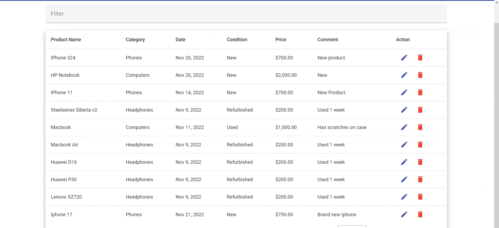

A basic Angular app with a simple form and a list of items. The app is built using the Angular CLI and uses the Angular Material UI library.

<h2>Home</h2>

<h2>Filter</h2>

<h2>Add</h2>

<h2>Edit and delete</h2>
